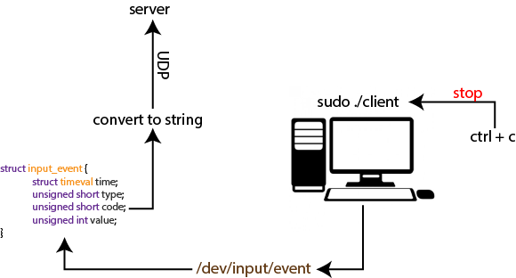

<h1 align="center">
  KEYLOGGER
  <br>
  
  <br>
</h1>

# Not finished

<div align="center">
 <h2>BUILD</H2>
</div>

```
make server
make linux_client
make windows_client
```

<div align="center">
 <h2>RUN</H2>
</div>

For run server :
```
./server
```
For run linux_client:
```
sudo ./client
```

<div align="center">
 <h2>EXPLAIN</H2>
 <br>
  
 </br>
</div>

<h4>
SERVER :
  <div align="center">
    
  </div>
</h4>
The server porgram uses the UDP protocol (without connected mode).
When the program receives a data, it will write it in IP.log.
<br>
<br>
<i>The server can only run on linux machines</i>

<h4>
LINUX CLIENT :
<div align="center">
    
  </div>
</h4>

<h5>
  Program operation :
</h5>

This program reads the contents of the `file/dev/input/event*([0-9])`
which is in the form of a struct :
```c
struct input_event{
  struct timeval time;
  unsigned short type;
  unsigned short code;
  unsigned int value;
};
```
we retrieve the code which will then be converted into a real 
keyboard touch. We send the key to the server with the udp protocol.

<h5>
  SIGNAL :
</h5>
The SIGINT(ctl + c) signal is redirected for a clean stop of the program.

<h5>
  Why /dev/input/event ?
</h5>
The /dev directory contains all files for all devices.<br />
So we go to input directory to have all the input files.


<div align="center">
 <h2>DISCLAILER</H2>
</div>

I made an educational program to see how this kind of program works on linux and windows machines. 
I am not responsible for the use that can be made of it.
You can do this commande `cat /proc/bus/input/devices` to have
all the possible entries with their name and to see the correct event file. In my case it is the /dev/input/event0 file.

<br>
<br>

If you have any suggestions for improvement, I am always interested