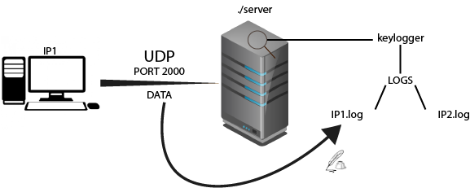

<h1 align="center">
  KEYLOGGER
  <br>
  
  <br>
</h1>

# Not finished

<div align="center">
 <h2>BUILD</H2>
</div>

```
make server
make linux_client
make windows_client
```

<div align="center">
 <h2>RUN</H2>
</div>

For run server :
```
./server
```
For run linux_client:
```
sudo ./client
```

<div align="center">
 <h2>EXPLAIN</H2>
 <br>
  
 </br>
</div>

<h4>
SERVER :
  <div align="center">
    
  </div>
</h4>
The server porgram uses the UDP protocol (without connected mode).
When the program receives a data, it will write it in IP.log.

###### The server can only run on linux machines

<h4>
LINUX CLIENT :
</h4>

<div align="center">
 <h2>DISCLAILER</H2>
</div>
I made an educational program to see how this kind of program works on linux and windows machines. I am not responsible for the use that can be made of it